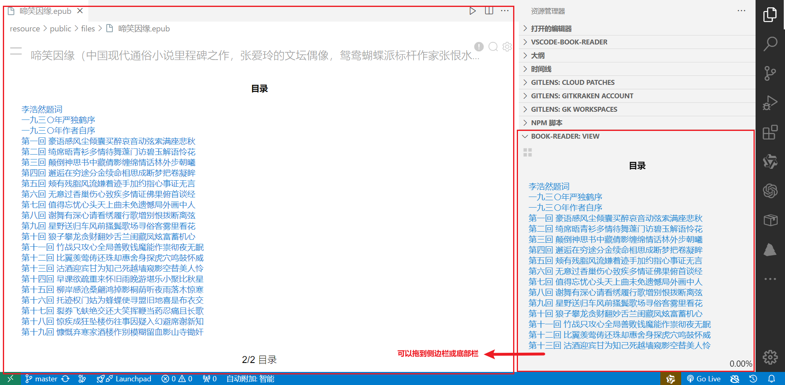

# Book Reader

Support reading epub、mobi、azw3、pdf、fk8、fb2、cbz files in vscode.

支持在vscode中阅读epub、mobi、azw3、pdf、fk8、fb2、cbz电子书.

## [Demo](https://jinhuan138.github.io/vscode-book-reader/)

## Features

| Feature                     | **Description**                                              |
| --------------------------- | ------------------------------------------------------------ |
| **🔍Full-Text Search**       | Search across the entire book to find relevant sections.     |
| **🎨Customize Style**        | Adjust font、 colors 、backgroundColor...for a personalized experience. |
| **⌨️keyboard events**        | Use ⬆️⬇️⬅️➡️ to turn the page                                    |
| **🔁Scroll/Page View Modes** | Switch between scrolling or paginated reading modes,shortcut key:s |
| **👀view the image**         | View images and Download in the book                               |
| **🎤read  book**             | Read  book                                                   |

