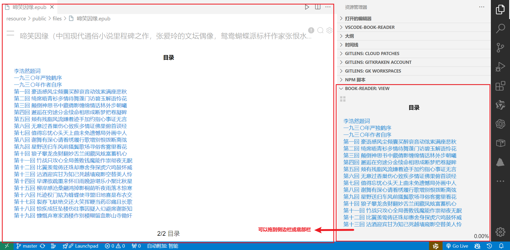

# Book Reader

Support reading epub、mobi、azw3、pdf、fk8、fb2、cbz files in vscode.

支持在vscode中阅读epub、mobi、azw3、pdf、fk8、fb2、cbz电子书。

## [Demo](https://jinhuan138.github.io/vscode-book-reader/)

## Features

| Feature                      | **Description**                                                           |
| ---------------------------- | ------------------------------------------------------------------------- |
| **🔍Full-Text Search**       | Search across the entire book to find relevant sections.                  |
| **🎨Customize Style**        | Adjust font、 colors 、backgroundColor...for a personalized experience.   |
| **⌨️Page Navigation**        | Navigate pages using arrow keys (⬆️⬇️⬅️➡️) or WASD                        |
| **🔁Scroll/Page View Modes** | Switch between scrolling or paginated reading modes,shortcut key:s        |
| **👀view the image**         | View images and Download in the book                                      |
| **🎤read book**              | Read book                                                                 |
| **🔖Bookmark**               | Add and manage bookmarks for the current reading position.                |
| **🖍️Highlight & Annotation** | Select text to highlight or underline, choose color and save annotations. |
| **🌐Translate Selection**    | Translate selected text instantly with target language selection.         |
| **💬Annotation Tooltip**     | Hover on annotations to view the referenced content                       |
